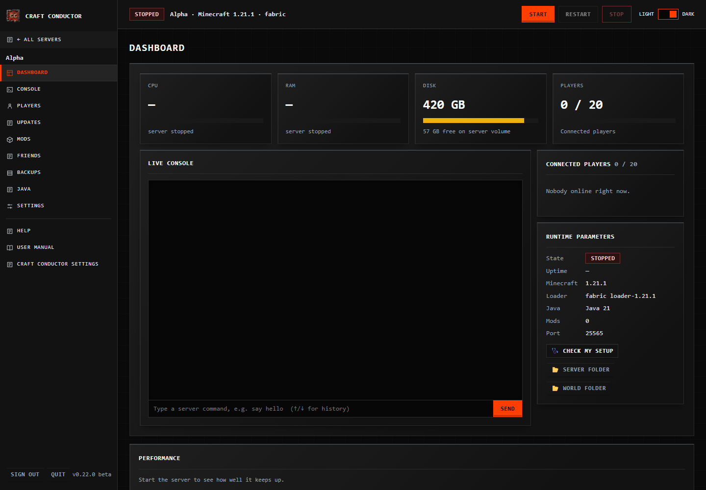
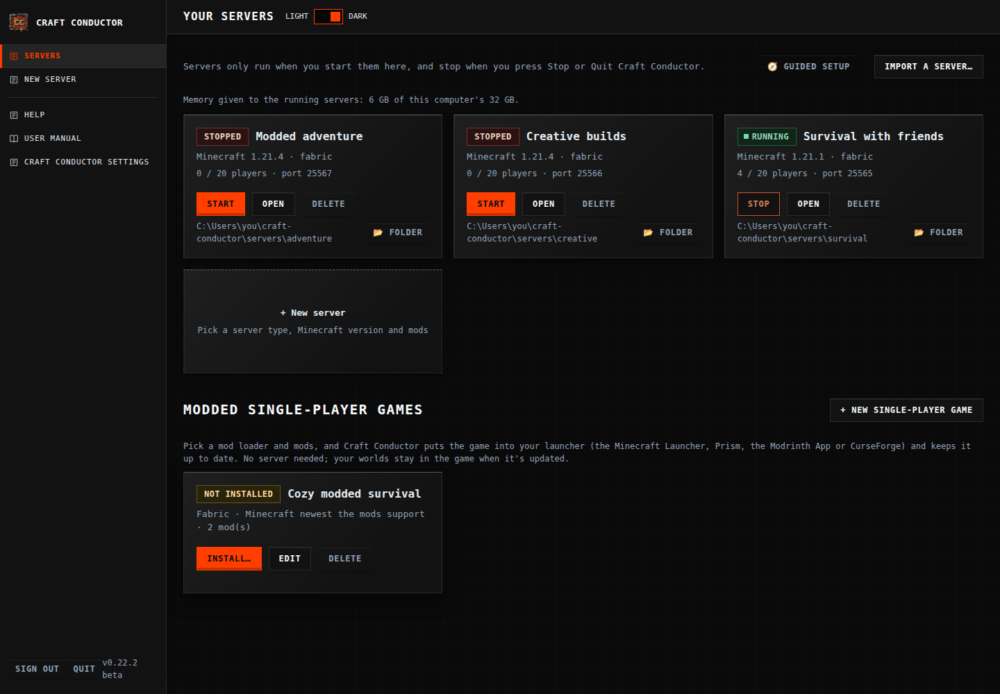
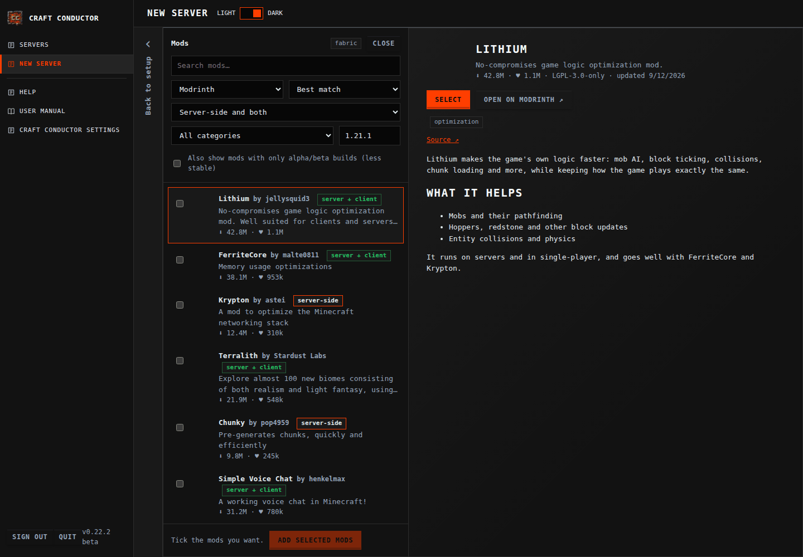
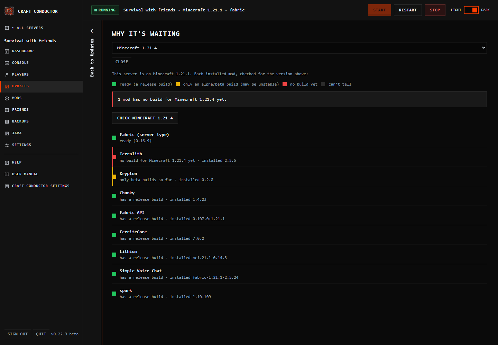
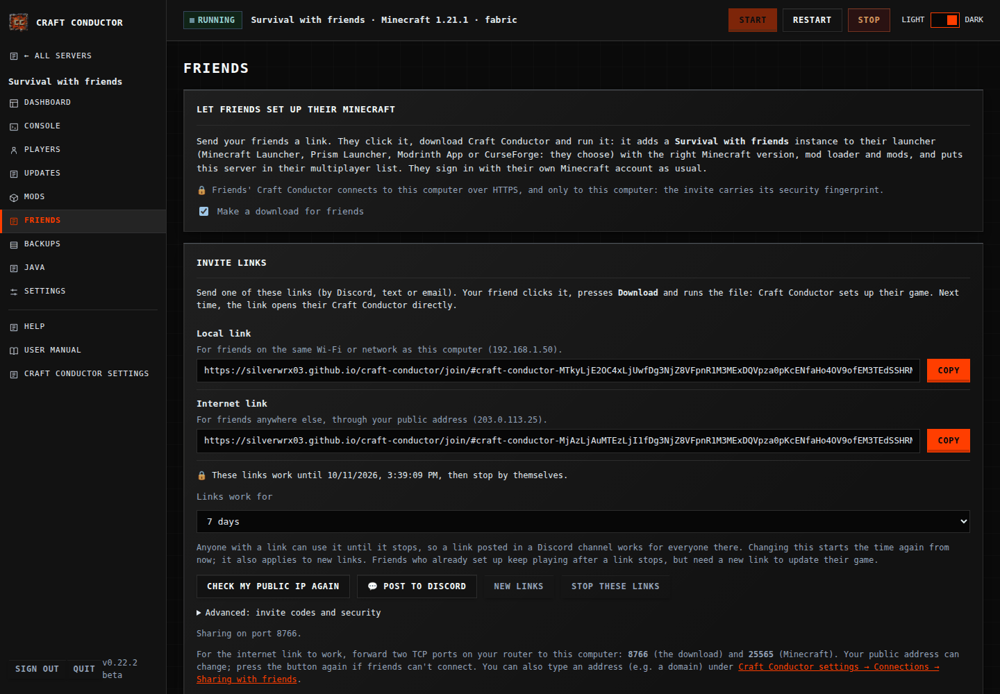
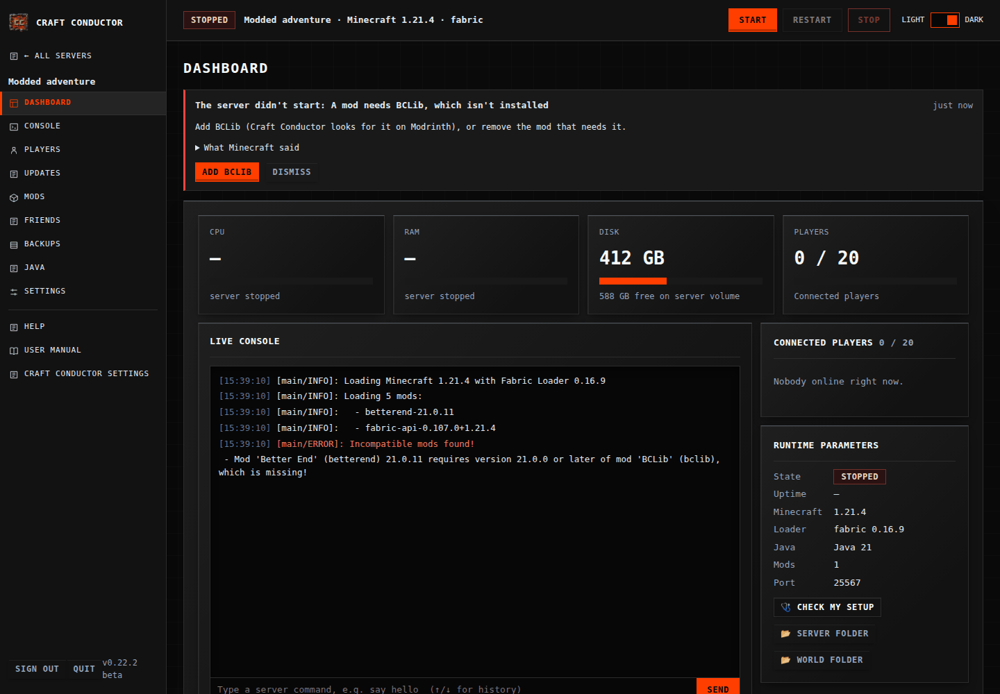
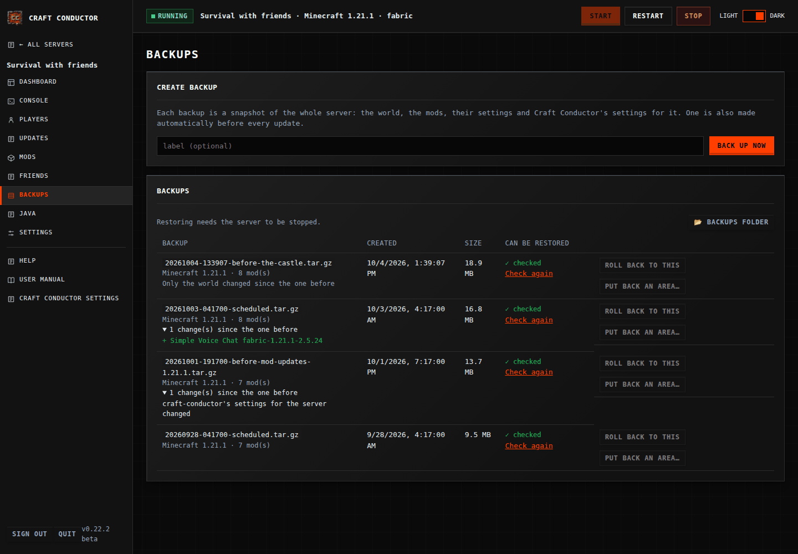

# Craft Conductor: Creating and managing  your own modded  Minecraft server should be easy! 


**Running a Minecraft server with friends should be as easy as playing on one.** Craft Conductor
sets up a modded or plain Minecraft server on your own computer, keeps it running, and keeps it
and its mods up to date for as long as you play. It also gets your friends' games ready to join.
Everything happens in a control panel in your browser: no command lines, no config files, no
hunting for the right mod versions.

The control panel has light and dark themes, raised resource widgets, and a boxed live console.
On phones, a hamburger menu contains navigation and the remembered Light / Dark slider.

> **Craft Conductor is in beta.** Keep backups (it makes one before every update), and please report
> problems in [Issues](https://github.com/silverWRX03/craft-conductor/issues).



## What it does

- **Makes a server for you:** Fabric, NeoForge, Forge, Quilt, Paper or plain Minecraft, with the
  right Java, loader and mods, checked to start before you play.
- **Keeps it up to date:** it moves to a new Minecraft **once every mod supports it**, with a backup
  first and an automatic rollback if the new version doesn't start.
- **Finds mods and modpacks** on Modrinth and CurseForge, adds what they need, and tells you which mod
  broke a server.
- **Gets your friends playing:** one link sets up their launcher with the right version and mods.
- **Looks after itself:** crash restarts, schedules, backups you can check, and plain-words help when
  something goes wrong.
- **Works from your phone,** with notifications, and on a Linux computer without a screen or in Docker.

<table>
<tr><td width="50%"><br>All your servers in one place</td><td width="50%"><br>Find mods on Modrinth and CurseForge</td></tr>
<tr><td width="50%"><br>A new Minecraft goes in once every mod is ready</td><td width="50%"><br>One link sets up your friends' game</td></tr>
<tr><td width="50%"><br>Plain words, and a fix, when a server won't start</td><td width="50%"><br>Backups that are checked, with what changed</td></tr>
</table>

The **[user manual on the wiki](https://github.com/silverWRX03/craft-conductor/wiki/Craft-Conductor-Manual)** shows everything, page by page with
pictures (it's also in the app: Help → User manual).

## Download and run

Get the file for your computer. It's a single file: no installer, no Python, and no Java to set up.

| Your computer | Download |
|---|---|
| Windows 10/11 (64-bit) | [`craft-conductor-windows-x64.exe`](https://github.com/silverWRX03/craft-conductor/releases/latest/download/craft-conductor-windows-x64.exe) |
| Mac with Apple silicon (M1 or newer) | [`craft-conductor-macos-arm64`](https://github.com/silverWRX03/craft-conductor/releases/latest/download/craft-conductor-macos-arm64) |
| Linux, 64-bit Intel/AMD | [`craft-conductor-linux-x64`](https://github.com/silverWRX03/craft-conductor/releases/latest/download/craft-conductor-linux-x64) |
| Linux on ARM (Raspberry Pi 4/5, 64-bit) | [`craft-conductor-linux-arm64`](https://github.com/silverWRX03/craft-conductor/releases/latest/download/craft-conductor-linux-arm64) |

1. **Open it.** On Windows, if SmartScreen says it "protected your PC", choose **More info → Run
   anyway** (Craft Conductor isn't code-signed yet). On a Mac, run it once from Terminal: see
   [Getting started](https://github.com/silverWRX03/craft-conductor/wiki/Getting-started).
2. **Your browser opens the control panel.** Accept the notice, sign in with `PASSWORD`, and choose
   your own password.
3. **Press New server,** pick the kind of server and your mods, and **Create my server**. Then
   **Start**, and join it from Minecraft.

**Joining a friend's server?** Open the invite link they sent you: it offers the right download and
sets up your game. See [Joining a friend's server](https://github.com/silverWRX03/craft-conductor/wiki/Joining-a-friends-server).

## Help

- **[User manual](https://github.com/silverWRX03/craft-conductor/wiki/Craft-Conductor-Manual)**: every page of the app, with pictures.
- **[Troubleshooting](https://github.com/silverWRX03/craft-conductor/wiki/Troubleshooting)**, and **Check my setup** on a server's Dashboard.
- **[Power users](https://github.com/silverWRX03/craft-conductor/wiki/Power-Users)**: the command line, `craft-conductor.toml`, running it as a service, Linux
  servers, Docker and more.
- [What's new](CHANGELOG.md) · [Report a bug](https://github.com/silverWRX03/craft-conductor/issues/new/choose) ·
  [Report a security problem](SECURITY.md) (privately, please)

## What Craft Conductor can't do

- It can't make your computer reachable from the internet by itself: friends outside your home
  need your **router's port forwarding** (Craft Conductor can set it up by itself with UPnP, or
  shows you how), or a playit.gg tunnel.
- It can't make mods work together when their authors haven't made them compatible. It can only
  find out, tell you, and wait for updates.
- It isn't a hosting service: the server runs on your computer, which has to be on for people to
  play.
- It doesn't collect usage data: no analytics, tracking, advertising or account. It isn't
  affiliated with Mojang, Microsoft, Modrinth or CurseForge.

## How Craft Conductor uses the CurseForge API

Craft Conductor talks to CurseForge only through its official API (`api.curseforge.com`), which needs
an API key. It follows CurseForge's
[terms for third-party apps](https://support.curseforge.com/en/support/solutions/articles/9000207405):

- **The key stays private.** Craft Conductor's own key is never in this repository or its source. Release
  builds get it at build time from a GitHub secret (`CURSEFORGE_API_KEY`, see
  [packaging/write_build_keys.py](packaging/write_build_keys.py)). A key you enter yourself is
  checked with CurseForge, then kept in Craft Conductor's settings file on your computer, readable only by
  you. It's never shown again, logged, or sent anywhere but CurseForge. A key you enter always
  takes priority over the built-in one.
- **Authors' wishes are respected.** When an author doesn't allow downloads by other apps,
  CurseForge gives no download link and Craft Conductor doesn't look for one. It shows you the file's
  page to download it yourself (you drop the file on its manual downloads panel), then checks that file
  against CurseForge's checksum. A modpack whose author doesn't allow it isn't installed.
- **Files come from CurseForge, not from Craft Conductor.** Every mod is downloaded from CurseForge's own
  servers straight to the computer that needs it (yours, or your friends' through their
  invite) and hash-checked. Craft Conductor doesn't host or re-share CurseForge files. A CurseForge
  modpack file that Craft Conductor makes for a friend's CurseForge app is built on that friend's own
  computer, from files downloaded there, for their own use.
- **Credit where it's due.** Mods found on CurseForge show their authors, and link to their
  CurseForge pages ("Open on CurseForge").
- **Light on the API.** Answers are cached for a few minutes, lookups only happen when you
  search, add mods or check for updates, and nothing is scraped from the website.
- **Only what's needed.** Craft Conductor reads mod and modpack details, files and categories. It sends no
  information about you, and doesn't use CurseForge data for anything but installing and
  updating your mods.

Craft Conductor isn't made or endorsed by CurseForge or Overwolf. Paper plugins come from Modrinth only.

## Naming and fresh installs

The command is `craft-conductor` (or `python -m craft_conductor` when installed with Python).
Configuration is `craft-conductor.toml`, per-server state is `.craft-conductor/`, and the
control panel's default home is `~/craft-conductor`. Environment variables use the
`CRAFT_CONDUCTOR_` prefix.

The upcoming 0.22 testing release requires a fresh setup. It does not migrate previous
installation names or settings. Copy any worlds you want to keep before switching.

## Development

```sh
pip install -e ".[dev]"
pytest
```

The tests run the full install → upgrade → crash → rollback cycle against a fake `java` and a
fake server, so they need no network and no Minecraft. See [For maintainers](https://github.com/silverWRX03/craft-conductor/wiki/For-Maintainers)
for test builds and releases, [CONTRIBUTING.md](CONTRIBUTING.md) for how changes are made, and
[TODO.md](TODO.md) for the roadmap.

## License

GPL-3.0-or-later. See [LICENSE](LICENSE), and [THIRD_PARTY_NOTICES.md](THIRD_PARTY_NOTICES.md) for the
licenses of everything Craft Conductor uses or downloads.
