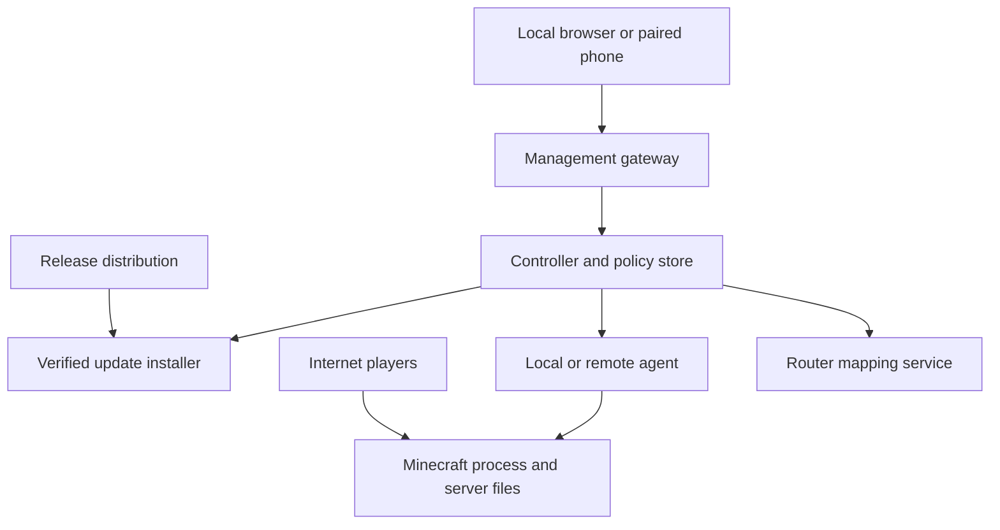
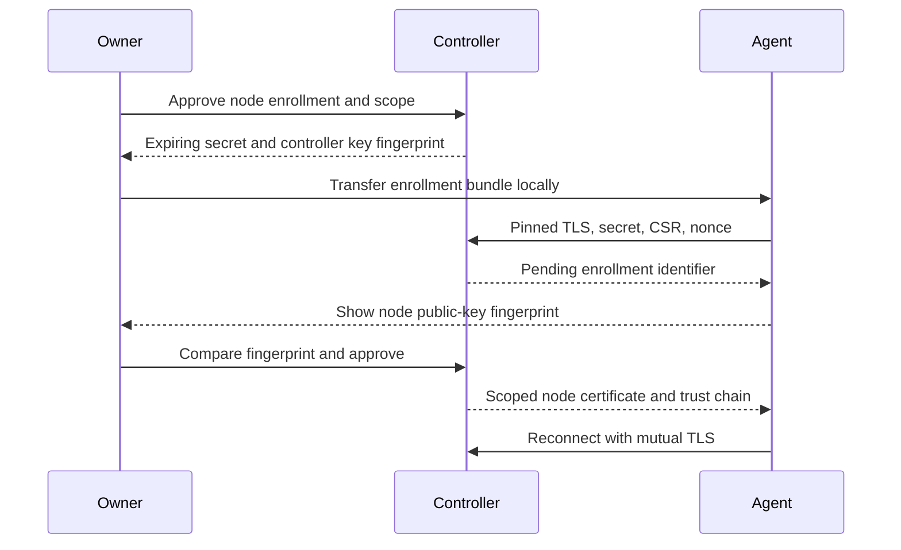

# Craft Conductor: Threat Model and Security Architecture

**Status:** Proposed design; not a security certification or completed implementation audit.  
**Date:** 2026-10-01  
**Project:** [silverWRX03/craft-conductor](https://github.com/silverWRX03/craft-conductor), Apache-2.0  
**Repository location:** `docs/security/THREAT_MODEL.md`  
**Document role:** Security architecture and threat-model design document; not a substitute for a root `SECURITY.md` vulnerability-reporting policy.  
**Audience:** Maintainers, contributors, security reviewers, and future implementation agents.

## 1. Purpose and scope

Craft Conductor manages modded Minecraft servers on personal Windows, macOS, and Linux computers. Its security objective is to make ordinary hosting safe by default while preventing web users, players, paired devices, malicious downloads, and remote nodes from gaining unintended control of the owner's computer or other servers.

This document covers the web panel, console and file operations, self-updates, router port mapping, phone access, per-server authorization, and a proposed node-agent protocol. Requirements marked **MUST**, **MUST NOT**, and **SHOULD** describe the target architecture. Numerical lifetimes and limits below are proposed defaults, subject to documented review.

The architecture prioritizes confidentiality of host credentials and personal files, integrity of executable software and worlds, explicit network exposure, and recoverability. Availability matters, but a personal computer cannot guarantee service during Internet denial-of-service attacks, power failures, or a compromised operating system.

### 1.1 Reviewed baseline

A targeted source review used commit `0518c43d2519d2b4562c5f0594908f5f348d479c`. These observations are not claims that every associated route or attack path was tested.

| Area | Observed baseline | Required architectural change |
| --- | --- | --- |
| Web panel | Loopback default; session cookies; custom mutation header; CSP; Host filtering in `config.py` and `web.py` | Exact origin/authority policy, explicit deployment modes, centralized authorization |
| Initial authentication | `webauth.py` supports a built-in initial `PASSWORD`, password/PIN modes, and random headless first-run credentials | Replace shared bootstrap credentials; corruption or recovery must never silently restore a known password |
| Phones | Five-minute, one-use pairing codes; hashed 256-bit device tokens; 180-day device lifetime; viewer/helper roles | Per-server grants, shorter renewable sessions, explicit enrollment approval and revocation semantics |
| Authorization | Phone route allowlists and hidden-GET exclusions in `web.py` | Default-deny operation and resource authorization, including all reads |
| Updates | Standalone files checked against release-hosted `SHA256SUMS.txt`; pip installs from a release tag | Independently authenticated release metadata, rollback protection, verified artifacts for every supported update path |
| UPnP | Opt-in setting; desired mappings include server TCP ports and an optional friends-download port in `hub.py` | Per-service consent, ownership-aware cleanup, stronger discovery and exposure policy |
| Distribution | `pyproject.toml` declares no runtime dependencies; signing documentation describes conditional Windows signing | Decide on a maintained cryptographic verifier/provider before enabling the proposed protocols |

Source anchors: [web.py](https://github.com/silverWRX03/craft-conductor/blob/0518c43d2519d2b4562c5f0594908f5f348d479c/src/craft_conductor/web.py), [webauth.py](https://github.com/silverWRX03/craft-conductor/blob/0518c43d2519d2b4562c5f0594908f5f348d479c/src/craft_conductor/webauth.py), [selfupdate.py](https://github.com/silverWRX03/craft-conductor/blob/0518c43d2519d2b4562c5f0594908f5f348d479c/src/craft_conductor/selfupdate.py), [hub.py](https://github.com/silverWRX03/craft-conductor/blob/0518c43d2519d2b4562c5f0594908f5f348d479c/src/craft_conductor/hub.py), [code-signing policy](https://github.com/silverWRX03/craft-conductor/blob/0518c43d2519d2b4562c5f0594908f5f348d479c/docs/code-signing.md).

Node-agent mutual authentication below is a proposed protocol, not a description of an existing verified implementation. The repository's mod-conflict relay is not a phone-control relay.

## 2. Assets, adversaries, and trust boundaries

### 2.1 Protected assets

| Asset | Security consequence of compromise |
| --- | --- |
| Host files, OS credentials, SSH keys, browser data | Personal data theft and host takeover |
| Manager executable, Java runtime, agents, mods | Persistent execution of attacker-controlled software |
| Worlds, configuration, backups | Destruction, griefing, data leakage, or recovery failure |
| Owner sessions, device credentials, enrollment secrets | Unauthorized control and persistent access |
| Update signing keys and controller CA keys | Fleet-wide compromise or fraudulent node enrollment |
| Server grants, node registry, revocation state | Cross-server privilege escalation |
| Router mappings, firewall rules, network addresses | Unintended Internet exposure and privacy loss |
| Audit records | Loss of accountability and incident evidence |

Adversaries include malicious websites visited by the owner, Internet scanners and players, hostile LAN devices or routers, compromised phones, malicious invited users, mod authors, compromised update infrastructure, and compromised nodes. Another OS user may attempt to read files or connect to loopback. A compromised process running as the owner's OS account is a stronger attacker than an ordinary remote user.

### 2.2 Logical architecture

These are logical boundaries; separate processes or OS identities are required where OS isolation is claimed. Browser input, network discovery responses, Minecraft output, archives, third-party metadata, and node telemetry are untrusted data.

The management gateway authenticates clients. The controller authorizes operations. Agents independently restrict what the controller may execute on their hosts. The update installer has a separate trust decision based on release signatures. Neither player access nor a download invite crosses into management authority.

### 2.3 Explicit limitations

- Mods and plugins are executable code. Separate directories and Java processes do not sandbox them. A malicious mod running under the manager's OS identity may read its secrets or alter its files.
- Meaningful containment requires separate restricted OS identities or a hardened container/VM configuration. Containers with privileged mode, host credentials, or broad host mounts do not provide the intended boundary.
- Administrator/root compromise, malicious firmware, and physical takeover are outside the application's prevention guarantee. Recovery guidance still applies.
- API permissions protect against API users; they cannot create filesystem isolation between processes with equivalent OS access.
- A valid signature proves authorization by a signing identity, not that the signed software is harmless.

## 3. Security invariants and deployment modes

1. No management listener is publicly reachable by default.
2. Every operation is authenticated and authorized for its exact resource, except narrowly documented bootstrap, login, and public-download endpoints.
3. Game invites, phone enrollment, owner sessions, and node enrollment use separate credential types and validators.
4. Downloaded executable content is never installed by the self-updater without authenticated metadata and matching bytes.
5. Network exposure and privilege increases require an explicit owner decision.
6. Invalid policy, missing trust material, or unsupported crypto disables the affected action; it never enables an insecure fallback.

| Mode | Binding and transport | Authentication and exposure |
| --- | --- | --- |
| Local desktop, default | Explicit `127.0.0.1`; optionally explicit `::1`; HTTP permitted only on direct loopback | Owner authentication remains required; no router mapping |
| LAN management, opt-in | Selected interface/address, HTTPS | Strong owner authentication or paired device; exact allowed origin |
| Remote management, opt-in | Authenticated private network/tunnel preferred; public HTTPS gateway only as an advanced mode | Application authentication remains required; no automatic management UPnP |
| Node agent | Outbound mTLS connection preferred | Pinned controller trust plus individual agent identity; no unauthenticated discovery enrollment |

Wildcard bindings (`0.0.0.0`, `::`) MUST require explicit configuration. A container's internal wildcard bind is not permission to publish a host port publicly. UI status MUST distinguish local-only, LAN, tunnel, and publicly exposed services.

## 4. Web control panel

### 4.1 Localhost, Host, and proxy protections

**WEB-01:** Bind literal loopback addresses, validate actual listening sockets, and fail if a requested safe binding cannot be established. Never retry with a wildcard address. Test IPv4, IPv6, and dual-stack behavior independently.

**WEB-02:** Require a syntactically valid, single HTTP authority/Host and compare it with the configured listener's exact accepted host and port. Reject arbitrary IP literals, wildcard `.local` acceptance, malformed authorities, and unconfigured aliases. DNS resolution to a local address does not make a hostname trusted.

**WEB-03:** For browser mutations, validate the exact Origin and a session-bound CSRF token, require the intended content type, and deny cross-origin CORS by default. A custom header can provide additional protection but is not authorization. GET/HEAD requests MUST NOT start servers, redeem invitations, or alter configuration. Bootstrap and login need origin protections too.

**WEB-04:** Trust forwarded headers only from an explicitly configured proxy over a protected backend connection. Strip untrusted forwarded headers at the edge. A reverse-proxy connection from loopback does not make its end user local. Local-presence actions require an OS-mediated channel or fresh local confirmation, not an IP-address heuristic.

### 4.2 Authentication and sessions

**WEB-05:** First launch creates a unique, short-lived owner bootstrap secret delivered through a local launcher or protected console/file. It authorizes only initial owner setup. Consume it atomically and invalidate it after ten minutes or successful setup. Missing/corrupt authentication state enters locked recovery, never a known-password mode. Local recovery revokes existing sessions and pending invites.

**WEB-06:** Prefer passkeys for owner access. Passwords support long passphrases, breached-password screening where practical, salted adaptive hashing, and versioned work factors. Benchmark the work factor on supported low-end hardware. If PBKDF2 is retained for compatibility, record algorithm and cost and upgrade hashes after successful login. PINs are only a local convenience and MUST NOT authorize remote enrollment or sensitive owner actions without stronger reauthentication.

**WEB-07:** Use opaque CSPRNG session identifiers with at least 256 bits of entropy. HTTPS cookies are host-only, HttpOnly, Secure, SameSite=Strict, and narrowly scoped. The direct-loopback HTTP cookie is an explicitly separate exception; never reuse it across the remote origin. Proposed owner session limits: 30-minute idle and 12-hour absolute expiry; sensitive actions require authentication within five minutes. Rotate after login and privilege changes. Logout and owner recovery revoke server-side state.

Apply bounded login throttles per account and source, plus a global budget. Avoid permanent account locks that an attacker can trigger. Limit unauthenticated request size, duration, and concurrency before expensive password hashing.

### 4.3 UI inputs, files, and downloads

**WEB-08:** Treat player names, logs, server names, mod metadata, release notes, filenames, and node errors as hostile. Render plain text by default. Sanitize any supported Markdown/HTML using a maintained allowlist. Never inject console output as HTML. Apply a restrictive CSP, no framing, no MIME sniffing, and no referrer leakage. Escape terminal control sequences in exported terminal-facing output.

**WEB-09:** Validate request schemas, types, sizes, enumerations, and unknown fields at the boundary. Reject ambiguous JSON keys and conflicting resource selectors. Bound uploads, decompressed archives, member counts, compression ratios, request concurrency, log subscriptions, and queued work. Authorization precedes expensive work.

**WEB-10:** Server file APIs operate on an authorized server root, not arbitrary host paths. Reject traversal, absolute paths, UNC/device paths, drive prefixes, alternate data streams, and platform-specific reserved names. Protect against symlink, hardlink, junction/reparse-point, and rename races using safe filesystem primitives. Archives cannot write links or escape their destination. Restore to staging and validate before replacement. Downloads of user content use attachments or a separate untrusted-content origin.

**WEB-11:** Outbound URL fetches prevent SSRF: restrict schemes, destinations, ports, redirects, and response sizes; reject loopback, link-local, private, and metadata addresses for Internet-download workflows. Revalidate redirect destinations and the actual connection address to resist DNS rebinding. Router discovery is a separate narrowly scoped exception, never a general URL-fetch permission.

### 4.4 Console and execution

**WEB-12:** A Minecraft console command is privileged even when it is not an OS shell command. Plugins can add commands that execute code or access files. Raw console access is therefore a trusted-administrator capability, not a routine helper capability.

Everyday moderation uses structured actions with validated arguments. Do not attempt to make raw console safe through a small blacklist. Reject embedded line breaks/NULs in one-command APIs, bound length, and audit the action without logging secrets.

**WEB-13:** Launch programs through fixed executable paths and argument arrays, never shell interpolation. User-controlled Java paths, JVM arguments, environment variables, startup hooks, JARs, and working directories are execution privileges. Restrict them separately from ordinary server settings. Sanitize inherited execution-related environment and avoid executable lookup in server-controlled directories.

**WEB-14:** WebSocket/SSE/log streams authenticate on connection, authorize each subscription, and terminate after revocation or expiry. WebSockets additionally validate Origin and authorize each command message. Reconnection is not a way to bypass quotas. [R2]

## 5. Self-updater security

### 5.1 Trust model

**UPD-01:** A SHA-256 checksum detects a mismatch only when the expected digest is trustworthy. A binary and checksum fetched from the same compromised release account can agree and still be malicious. TLS and platform code signing are useful independent layers, but do not replace authenticated update metadata.

Adopt a maintained implementation of The Update Framework (TUF) or an independently reviewed equivalent. Ship an initial trusted root with the application. Use separated root, targets, snapshot, and timestamp responsibilities; offline threshold-controlled root keys; and restricted online signing identities. Bind target hashes and lengths to the complete verified metadata chain. Reject expired, rolled-back, or inconsistent metadata. [R1]

The project's standard-library-only runtime policy creates a design dependency: Python's standard library is not a complete TUF/signature-verification stack. A vetted bundled verifier, reviewed platform integration, or an explicit dependency-policy change MUST be selected. Do not implement custom cryptographic primitives to preserve zero dependencies. Until this gate is met, do not describe checksum-only automatic updates as authenticated, and disable that automatic installation path in the hardened mode.

### 5.2 Release identity and channels

**UPD-02:** Authenticated metadata identifies product, channel, version, monotonically increasing release sequence, OS, CPU architecture, artifact length and digest, minimum updater version, and metadata expiration. Artifact names and GitHub tags are not sufficient identities. Match the artifact to the actual supported platform; unknown architectures fail closed.

| Channel | Proposed behavior |
| --- | --- |
| Stable | Default; reviewed releases only; no prerelease substitution |
| Beta | Explicit owner opt-in; separate delegated authorization and visible UI label |
| Development/custom | Separate trust configuration and prominent warning; never selected by failed stable checks |

Persist the highest trusted metadata versions and accepted release sequence. Switching channels requires reauthentication and a preview of the exact target. A signed older artifact is still a downgrade: normal updates reject it. Exceptional recovery requires explicit local approval and records the reason. Maintain a security floor for revoked/vulnerable builds. Clock errors must produce a repairable verification failure, not disabled expiry checks.

### 5.3 Installation transaction

**UPD-03:** Use this sequence: authenticate metadata; select target; download with time/size limits; verify complete length/digest; verify applicable platform signature; stage privately; obtain an installation lock; preserve recoverable state; replace atomically where supported; restart; health-check; commit or recover.

- The staging directory and parent destination have owner-only POSIX permissions or equivalent Windows DACLs. Reject attacker-writable parents, links, and unexpected destination changes.
- Never execute a download to discover its version before verification. Recheck the exact staged file immediately before replacement; avoid verification-to-execution races.
- Windows needs a trusted minimal helper and crash-recoverable rename journal because a running executable cannot simply be replaced like a Unix file. Helper arguments identify fixed validated paths, not arbitrary commands.
- Do not request elevation silently. For managed installations, delegate to the OS/package manager or require an explicit owner-approved install action.
- Keep the previous verified binary until health checks succeed. Back up configuration before migration. Binary rollback alone may not undo schema changes; migrations must declare recovery compatibility.
- Release metadata, network failures, or full disks leave the existing installation usable. A failed update never triggers an unsigned fallback.

**UPD-04:** All install forms need a defined trust path. Replace automatic tag-based pip source installation with authenticated, immutable distribution artifacts and constrained build/dependency inputs, or make it an explicit package-manager-managed workflow. Source checkouts and container images use their documented operator update paths; the application must not silently switch installation methods.

**UPD-05:** Release CI uses protected changes, restricted workflow permissions, pinned build dependencies/actions, isolated build/signing steps, and human release approval. Produce provenance and an SBOM; sign final distributed bytes after platform signing. Key rotation follows authenticated root transitions. Suspected signing-key compromise freezes affected update channels and invokes out-of-band recovery when the remaining trust threshold is insufficient.

## 6. UPnP and network exposure

### 6.1 Consent and mapping lifecycle

**NET-01:** UPnP is off by default. Consent selects the exact server, protocol, internal port, external port, and duration. Creating another server or changing a port requires renewed consent. A friends-download service is a separate exposure with separate approval.

Suggested warning:

> This makes this server reachable from the Internet. Anyone may attempt to connect, and Minecraft or mod vulnerabilities could affect this computer. Only the listed game port will be opened. Your control panel stays private. You can close access here at any time.

**NET-02:** Never automatically map the management panel, node-agent API, RCON, debugger, SSH, databases, or OS file-sharing ports. Check both the service identity and actual listening port to prevent a port collision from exposing the wrong service. Preserve Minecraft authentication/allowlists where applicable; do not disable them to solve connectivity issues.

**NET-03:** Use renewable finite leases, proposed one hour, renewed only while the approved service should be exposed. For routers supporting permanent mappings only, require explicit consent explaining crash-cleanup limits. Maintain a ledger containing router identity, local interface, protocol, ports, lease, and service association. Refuse to overwrite existing conflicting mappings.

On stop, consent withdrawal, or uninstall, remove only mappings still matching the recorded tuple and internal destination. A mapping description is not proof of ownership. Reconcile after restart and report cleanup failures. Suspend renewal when the network/router changes until its policy is confirmed. Never promise a port is closed solely because an API delete returned success.

### 6.2 Hostile discovery and router responses

**NET-04:** SSDP/UPnP responses are unauthenticated. Restrict discovery to the selected local network interface. Validate description and SOAP control URLs against the selected gateway/network and revalidate redirects; disallow userinfo, unexpected schemes, arbitrary hosts, and sensitive destinations. Cap XML bytes/depth, disable external entity retrieval, enforce timeouts, and limit discovery traffic. Router data cannot instruct the application to execute programs or change unrelated firewall policy.

### 6.3 CGNAT, double NAT, and IPv6

**NET-05:** A successful mapping means only that one router accepted a rule. It is not proof of Internet reachability. Private WAN addresses, shared address space `100.64.0.0/10`, and mismatches with an optional external-address observation indicate possible upstream NAT; they do not uniquely identify the topology. [R3]

The UI distinguishes “mapping created,” “reachability unknown,” “externally verified,” and “blocked/unreachable.” External checks are opt-in, limited to the approved service, and disclose the contacted service. Hairpin-NAT failure must not be labeled definitive external failure.

Under CGNAT/double NAT, offer explanatory guidance, an authenticated private overlay/tunnel, or ISP-provided public addressing. Do not suggest a router DMZ, blanket firewall disablement, or automatic mappings through untrusted upstream devices.

IPv6 may make a service globally reachable without IPv4 forwarding. Inspect listener addresses and host firewall policy independently. Any IPv6 pinhole requires separate consent, restricted scope, and expiration. Router mappings cannot overcome ISP filtering, and removing an IPv4 mapping does not close an IPv6 listener.

## 7. Phone remote access and pairing

### 7.1 Transport and credential separation

**PHN-01:** Remote access is disabled by default. Prefer an authenticated private network with HTTPS. An advanced public deployment requires a hardened HTTPS gateway, explicit origin configuration, throttling, and current patches. No remote login, pairing secret, or session travels over plaintext HTTP.

A tunnel that terminates TLS can observe application traffic and is a trusted processor unless an independently designed end-to-end channel exists. Do not advertise end-to-end confidentiality by assumption. A normal browser cannot implement certificate pinning by reading a fingerprint from JavaScript after accepting an invalid certificate. Use browser-trusted HTTPS or an explicitly provisioned private CA; never train users to bypass certificate warnings. Native clients may pin a key obtained through a trusted out-of-band channel.

Game/download invitations never grant panel access. Phone enrollment cannot issue node identities. Every credential has a purpose, issuer, audience, subject, expiry, and scope enforced by its validator.

### 7.2 Enrollment flow

**PHN-02:** Enrollment proceeds as follows:

1. A recently authenticated owner selects specific existing server IDs and capabilities. Default to viewer; show the exact resulting permissions.
2. The controller creates a 256-bit random one-use invite, stores only its hash with scope and five-minute expiry, and displays a QR link. No authority is taken from phone-supplied role fields.
3. The phone opens the configured HTTPS origin. The secret is in the URL fragment, never its query/path. The page clears the fragment from history immediately and submits it in a protected POST. It loads no third-party scripts, images, analytics, or link previews.
4. Redemption atomically reserves the invite for one pending device. GETs and preview fetches cannot consume it. Concurrent attempts cannot enroll two devices.
5. The local owner confirms the pending device using a matching short comparison phrase displayed on both screens. Device names are untrusted labels. Approval atomically consumes the invite and creates the scoped device record; timeout or denial requires a new invite.
6. The phone receives its session only after approval. Show enrollment time, granted servers, expiry, and a revoke control on the owner device.

A typed-code fallback is a separate, high-entropy random value, rate-limited per invite, source, and globally. Use at least the existing approximately 59-bit code space; do not reduce it to an unthrottled six-digit code. Limit failed attempts to five per invitation lifetime and cap pending enrollment records. Link possession alone does not establish which person is enrolling.

### 7.3 Expiration, replay, and revocation

**PHN-03:** Proposed phone policy: 15-minute access sessions; rotating persistent renewal credential with a seven-day inactivity and 30-day absolute lifetime. Renewal never extends the absolute enrollment lifetime. Store browser credentials only in HttpOnly, Secure, host-only cookies; do not use localStorage, URLs, diagnostics, or JavaScript-readable persistent storage for bearer secrets. Store token hashes server-side and compare safely. Native applications use OS secure credential storage.

Use atomic refresh rotation with a token-family identifier and reuse detection. A replayed consumed renewal token revokes the family. Clients serialize refresh attempts; after an ambiguous lost response, require a safe recovery/re-pair flow rather than accepting an old token indefinitely.

Bearer credentials remain replayable if stolen before expiration. TLS, short lifetimes, secure storage, and revocation reduce this risk; they do not eliminate it. If stronger device binding is required, adopt a maintained standard proof-of-possession mechanism rather than a custom request-signing scheme.

**PHN-04:** Mutation requests include an unpredictable request ID, bound to the authenticated device, server, operation, and payload digest. Store deduplication records for the documented retry window. Reusing an ID with different content is rejected. This prevents duplicate effects during retries; it is not a substitute for authentication or theft resistance.

Revocation invalidates access/renewal credentials, pending enrollment, and active streams immediately at the controller. Recheck current grants on every request and queued operation. Remote agents stop accepting new work within their bounded policy lease. Removing a device does not restore deleted data or undo completed commands. Notifications are server-scoped and omit secrets by default.

## 8. Granular per-server capabilities

### 8.1 Authorization model

**AUTHZ-01:** Represent a grant as subject ID, immutable server ID, capability set, constraints, expiry, and policy revision. Subjects include people, paired devices, and constrained service identities. A display name or filesystem path is not an identity. Deleting and recreating a server produces a new ID; cloning does not copy grants.

For each request, enforce the intersection of current subject grants, session scope, server scope, and applicable agent policy. Resolve the server once and pass an immutable authorized operation context through the operation. Never rely on a mutable global “selected server.” Unknown endpoints/capabilities and missing grants deny by default.

### 8.2 Capability catalog and suggested presets

| Capability | Scope and risk | Viewer | Operator | Trusted server admin |
| --- | --- | --- | --- | --- |
| `server.view` | Status and non-sensitive metadata | Yes | Yes | Yes |
| `logs.read` | Redacted logs; may still contain player data | Explicit | Explicit | Yes |
| `server.start`, `server.stop`, `server.restart` | Availability control | No | Yes | Yes |
| `players.moderate` | Structured kick/ban/allowlist actions; excludes granting OP | No | Explicit | Yes |
| `players.grant_operator` | Powerful in-game authority | No | No | Explicit |
| `backup.create` | Bounded snapshot creation | No | Yes | Yes |
| `backup.download` | World and configuration disclosure | No | No | Explicit |
| `backup.restore`, `backup.delete` | Destructive state change | No | No | Explicit |
| `settings.safe.write` | Enumerated non-execution settings | No | No | Yes |
| `files.read`, `files.write` | Separate path-constrained grants | No | No | Explicit |
| `console.execute` | Raw command authority; potentially executable via mods | No | No | Explicit |
| `mods.manage`, `runtime.configure` | Install executable content or change launch behavior | No | No | Explicit |
| `server.update.apply` | Changes executable game/mod software | No | No | Explicit |
| `server.delete` | Destructive removal | No | No | Explicit |

“Explicit” means excluded from the preset unless separately approved. Presets are editable templates, not bypasses. Global owner-only capabilities include manager self-update, user/grant administration, remote-access configuration, router/firewall policy, node enrollment, and trust-root changes. Server administrators cannot grant these to themselves.

**AUTHZ-02:** Configuration files are classified by effect. Editing launch scripts, JVM arguments, mods, plugin configuration with execution hooks, or arbitrary JARs requires execution-level permission even through a generic file editor or backup restore. A narrow settings permission cannot become host execution through an alternate route. Installing a signed game update still requires authority to change executable software.

**AUTHZ-03:** Apply the same checks to list/search results, metrics, logs, backup URLs, exports, jobs, notifications, batch requests, CLI service calls, and agent RPCs. Batch actions authorize every server and disclose per-item results without leaking unauthorized resource existence. Downloads use short-lived audience- and resource-bound tickets and recheck revocation at redemption.

**AUTHZ-04:** Queued jobs retain subject, resource, payload digest, and policy revision. Reauthorize immediately before execution. A scheduler receives an explicit service grant; it does not inherit an owner's unlimited authority forever. Grants to “all current servers” expand to explicit IDs unless a separately approved future-server policy is chosen.

## 9. Node-agent pairing and mutual authentication

### 9.1 Identities and enrollment

**NODE-01:** Each installation has a controller ID and private deployment CA. Each agent generates its own private key locally. The private key never leaves the node. Controller and agent credentials are separate from release-signing and browser credentials.

Use TLS 1.3 with a maintained TLS/certificate provider. Python TLS support does not by itself solve CA issuance, enrollment, secure key storage, or protocol verification. Choose and review that provider before implementation; no homemade cryptographic protocol.

**NODE-02:** Require possession and human verification at both ends:

The bundle contains the controller endpoint, exact controller key/CA fingerprint, protocol version, deployment ID, and a random 256-bit single-use secret expiring after ten minutes. Transfer it via the authenticated local UI or another trusted channel. Never fetch the trust pin from the unauthenticated endpoint it is meant to authenticate.

Before sending the secret, the agent validates the TLS peer against the transferred pin. It submits a CSR proving possession of its own key, plus fresh nonce and the enrollment identifier. The controller binds the pending record to the CSR digest and validates proof of possession. The owner compares the full fingerprint or a sufficiently strong derived comparison representation with the node's local display, then approves that exact key.

Enrollment consumption and certificate issuance are atomic. A retry may retrieve the same result only with proof of the same enrolled key; it cannot replace the CSR or create a second node. Expired, used, denied, or wrong-deployment bundles fail. Rate-limit before expensive CSR processing. Do not place enrollment secrets in process arguments, command history, logs, or source repositories.

### 9.2 Operational mTLS and authorization

**NODE-03:** Issue short-lived certificates, proposed 24 hours with renewal after 12 hours, using appropriate client/server extended key usages and SAN identities for deployment and node/controller IDs. Check chain, expected peer identity, validity, registry status, and protocol version on every connection. “Signed by this CA” alone does not authorize an arbitrary node. Agents accept only their pinned controller deployment; controllers accept only active registered node IDs.

Prefer an outbound agent connection so home routers need no inbound agent port. A reverse connection changes transport direction, not authentication requirements. Avoid TLS 0-RTT for management mutations because early data can be replayed. [R4]

**NODE-04:** Certificates identify peers; current policy authorizes work. Each RPC names the operation, server ID, initiating subject, grant revision, request ID, deadline, and payload digest. The authenticated controller is trusted to assert the user identity; this design does not make agents independently resistant to a compromised controller lying about users.

The agent independently restricts requests to locally assigned server IDs, approved filesystem roots, supported typed operations, and local execution ceilings. No general remote shell, arbitrary executable path, or arbitrary download-and-run RPC exists. Agent self-updates independently verify the release trust chain even when requested by the controller.

**NODE-05:** Reject expired commands and duplicates; persist deduplication state across restarts. For destructive or non-idempotent actions, journal acceptance and outcome. After a crash with uncertain completion, reconcile state instead of blindly replaying. Do not claim generic exactly-once execution. Bound request size, concurrency, output volume, and per-server jobs.

### 9.3 Revocation, outages, and rotation

**NODE-06:** Maintain an active-node registry and revocation state in addition to certificate expiry. Push revocations and close affected connections immediately while connected. Require a renewable five-minute authorization lease for new remotely requested actions; an offline agent stops accepting new remote work when the lease expires. Existing Minecraft processes can continue running. Previously authorized autonomous schedules need explicit bounded local policy.

Renew certificates only over authenticated mTLS for an active identity. Expired certificates do not get an unauthenticated renewal exception: require owner-mediated re-enrollment. Support leaf-key rotation with proof of the current identity and new-key possession. CA rotation uses an authenticated, bounded overlap; unexpected root changes require local approval.

Reinstalling or cloning a node creates a new key and ID. Never ship a pre-enrolled agent image. Removing a node cancels queued work and revokes credentials; securely remove local key material where practical. A stolen node key is contained to that node's scope. A controller/CA compromise is broader and requires revoking controller trust and re-enrolling through a trustworthy channel.

## 10. Storage, auditing, and recovery

**OPS-01:** Store credentials and policy outside game-controlled directories. Prefer OS key stores for device and CA private keys. Restrict files with Windows DACLs or POSIX ownership/modes from creation, including temporary files. Encrypt sensitive backups with separately managed recovery material; encryption whose key sits beside the backup does not protect against the same filesystem compromise.

**OPS-02:** Audit authentication outcomes, enrollment/approval/revocation, authorization denials, grant edits, console/execution actions, update verification/install outcomes, port mapping changes, and node lifecycle events. Record time, actor, device/node, server, operation, request ID, result, and relevant policy version. Never record credentials, full invite URLs, private keys, or indiscriminate console contents. Protect logs, cap disk use, and default to 30 days' retention. Redact exported diagnostics.

Local logs are not tamper-proof against the same OS account or administrator. Optional external append-only logging can improve evidence, with explicit privacy consent. Clock jumps are logged; monotonic clocks govern in-process timeouts, while trusted wall time is necessary for certificate and metadata expiry.

**OPS-03:** Provide an authenticated “disable remote access” action that closes management gateways, revokes phones and pending invitations, cancels queued remote operations, and attempts owned mapping removal. Report anything that could not be closed. A separate node-removal action revokes node credentials. Local owner recovery works without Internet access but invalidates stale credentials rather than preserving unknown access.

Incident procedures cover stolen phone, malicious mod, compromised node, compromised controller, and release-signing compromise. Restore worlds separately from credentials; backup restoration must not revive revoked devices, replay enrollment secrets, or roll back security sequence counters. After suspected host compromise, rebuild from trusted media and rotate exposed secrets; changing the panel password alone is insufficient.

## 11. Threat register

Priority denotes design urgency, not a measured exploitability score. **P0** is a release gate for the relevant feature; **P1** is required hardening before broad exposure.

| ID / STRIDE class | Attack and impact | Primary controls | Priority / residual risk |
| --- | --- | --- | --- |
| T01 Spoofing / elevation | Website reaches loopback through rebinding or CSRF | WEB-01–04 | P0; browser/extension compromise remains |
| T02 Tampering / elevation | Log, mod metadata, or release notes inject UI script | WEB-08, CSP, secure sessions | P0; authenticated XSS can act as its victim |
| T03 Elevation | Console, config, or path input becomes host execution | WEB-10–13, AUTHZ-02 | P0; trusted mods still execute code |
| T04 Spoofing / tampering | Release host substitutes binary and matching checksum | UPD-01–05 | P0; signer/build compromise requires separate response |
| T05 Tampering / denial | Old/expired release metadata freezes or downgrades clients | UPD-02–03 | P0; offline clients cannot obtain new fixes |
| T06 Information disclosure | UPnP exposes management or leaves stale mappings | NET-01–05 | P0; malicious routers can lie |
| T07 Spoofing | Shared/leaked phone invite or renewal token grants access | PHN-01–04 | P0; live bearer theft remains possible |
| T08 Elevation | User changes a server ID or accesses a hidden read route | AUTHZ-01–04 | P0; every operation needs coverage |
| T09 Spoofing / tampering | MITM substitutes node/controller during enrollment | NODE-01–03 | P0; unsafe out-of-band transfer defeats trust bootstrap |
| T10 Replay / tampering | Retried agent command repeats destructive work | NODE-04–06 | P0; uncertain crash outcomes need reconciliation |
| T11 Denial | Archive bomb, log flood, login flood, or job fan-out | WEB-09, quotas, bounded queues | P1; upstream link saturation remains |
| T12 Elevation / disclosure | Malicious mod steals same-account credentials | OS isolation, OPS-01 | P0 for isolation claims; accepted limitation in desktop shared-account mode |
| T13 Spoofing / disclosure | SSDP reply or remote URL induces SSRF | WEB-11, NET-04 | P0; explicitly trusted gateways retain network power |
| T14 Repudiation | Actions lack actor/resource evidence | OPS-02 | P1; local administrator can alter local evidence |

## 12. Security acceptance criteria

These are implementation gates, not tests performed by this document.

| Feature | Required evidence before acceptance |
| --- | --- |
| Local panel | No accidental IPv4/IPv6 wildcard bind; rejected malicious Host/Origin; CSRF attempts fail; proxy traffic cannot obtain local privileges |
| Authentication | Unique bootstrap; corrupt state stays locked; expiry, rotation, throttling, logout, and recovery revoke intended sessions |
| Input/console | Stored/reflected XSS fixtures remain inert; traversal/archive/link races cannot escape roots on all three OS families; structured commands cannot inject extra commands |
| Permissions | Table-driven checks cover every API method, stream, batch item, download, and background job; changing resource IDs never crosses grants; new routes deny by default |
| Updater | Corrupt hashes, bad signatures, expired metadata, downgrade, wrong platform/channel, redirect abuse, and partial downloads fail closed; interrupted install remains recoverable |
| UPnP | Router simulator covers hostile URLs/XML, lease expiry, port conflicts, permanent-only routers, network changes, cleanup failure, CGNAT, and separate IPv6 exposure |
| Phone pairing | Concurrent redemption yields one pending device; expiry/attempt limits work; preview GET cannot consume invite; denied approval grants nothing; refresh replay revokes family |
| Agent pairing | Wrong pin, wrong CSR/key, reused secret, wrong deployment, revoked/expired certificate, unsupported protocol, and changed root all fail |
| Agent execution | Cross-node/server requests, duplicate jobs after restart, stale grants, and unauthorized paths fail; disconnected nodes reject new remote work after five-minute lease expiry |
| Recovery/privacy | Diagnostics omit credentials; restore does not resurrect trust; disk exhaustion is bounded; owners can identify and revoke devices and exposure |

Review parser/protocol changes with fuzzing, authorization changes with negative tests, and cryptographic designs with independent security review. Test platform-specific ACLs and filesystem behavior on actual Windows, macOS, and Linux environments.

## 13. Delivery sequence and unresolved decisions

1. **Local foundation:** unique bootstrap, strict origins, centralized default-deny authorization, execution/file boundaries, and bounded inputs.
2. **Update trust:** select verifier/provider, establish signing-key custody, implement authenticated metadata and recoverable installation before enabling hardened automatic updates.
3. **Controlled exposure:** per-service router consent, HTTPS remote mode, device scopes, renewal/revocation, and truthful connectivity diagnostics.
4. **Distributed management:** independently reviewed enrollment protocol, mTLS lifecycle, agent policy ceilings, durable command reconciliation, and outage behavior.
5. **Isolation:** offer separate OS identities or hardened sandboxing for stronger mod containment; label shared-account mode accurately.

Before implementation, maintainers must resolve: cryptographic dependency policy; CA/key-store integration per platform; public HTTPS/tunnel trust model; signing-key custody for a small maintainer team; supported OS isolation modes; and update migration/recovery compatibility. These decisions may change implementation details, but must not weaken the stated invariants silently.

## 14. References

- **R1:** [The Update Framework specification](https://theupdateframework.github.io/specification/latest/) — update trust roles and metadata verification.
- **R2:** [OWASP WebSocket Security Cheat Sheet](https://cheatsheetseries.owasp.org/cheatsheets/WebSocket_Security_Cheat_Sheet.html) and [CSRF Prevention Cheat Sheet](https://cheatsheetseries.owasp.org/cheatsheets/Cross-Site_Request_Forgery_Prevention_Cheat_Sheet.html) — browser request and stream protections.
- **R3:** [RFC 6598: Shared Address Space](https://www.rfc-editor.org/rfc/rfc6598) — carrier-grade NAT address range.
- **R4:** [RFC 8446: TLS 1.3](https://www.rfc-editor.org/rfc/rfc8446) — authenticated transport and early-data replay considerations.

References inform this proposal; citing them does not establish implementation compliance.
