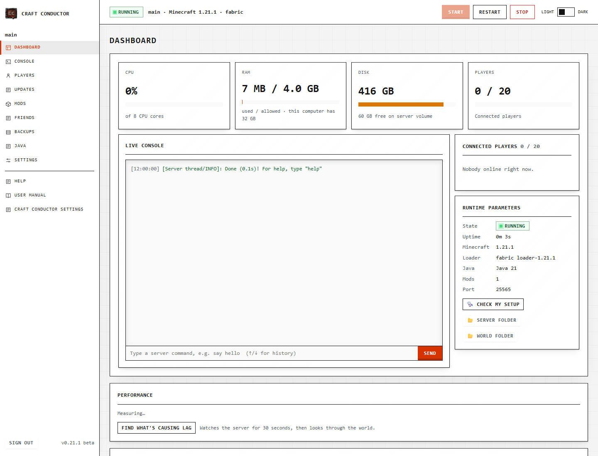

# Craft Conductor

**Running a Minecraft server with friends should be as easy as playing on one.** Craft Conductor sets up a modded or plain Minecraft server on your own computer, keeps it running, and keeps it and its mods up to date for as long as you play. It also gets your friends' games ready to join. Everything happens in a control panel in your browser.

## Where to start

- **[Download Craft Conductor](https://github.com/silverWRX03/craft-conductor/releases/latest)** for Windows, Mac (Apple silicon) or Linux: one file, nothing to install.
- **[The user manual](Craft-Conductor-Manual)**, page by page, with pictures. It's also inside the app (Help → User manual).
- **[Getting started](Getting-started)**: from downloading to your first server.
- **[Playing with friends](Playing-with-friends)**, and for your friends: **[Joining a friend's server](Joining-a-friends-server)**.
- **[Troubleshooting](Troubleshooting)** when something doesn't work.
- **[Power users](Power-Users)**: the command line, `craft-conductor.toml`, running it as a service, and more.

## Good to know

- Craft Conductor is in **beta**: keep backups (it makes one before every update) and please [report problems](https://github.com/silverWRX03/craft-conductor/issues/new/choose).
- [What's new](https://github.com/silverWRX03/craft-conductor/blob/main/CHANGELOG.md) in each version.
